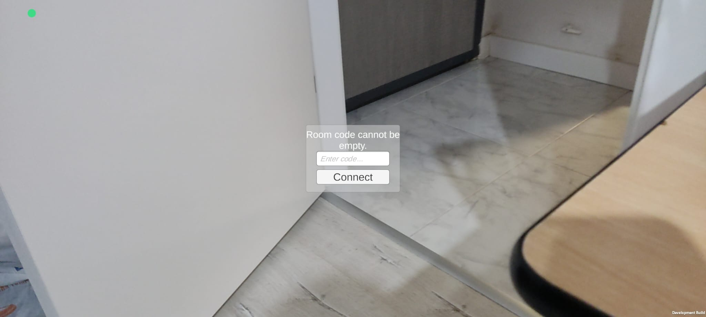
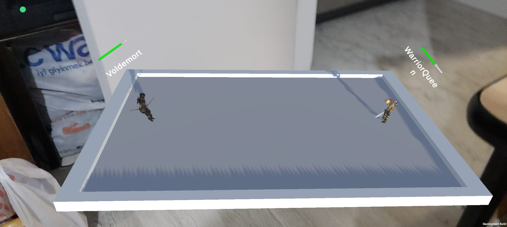
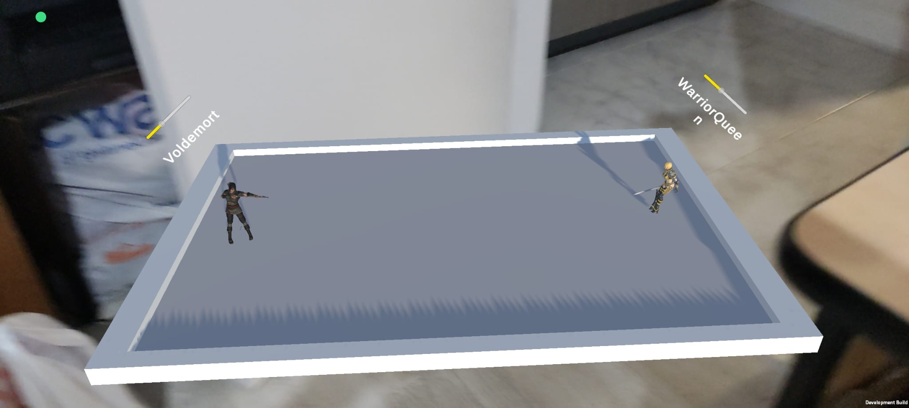
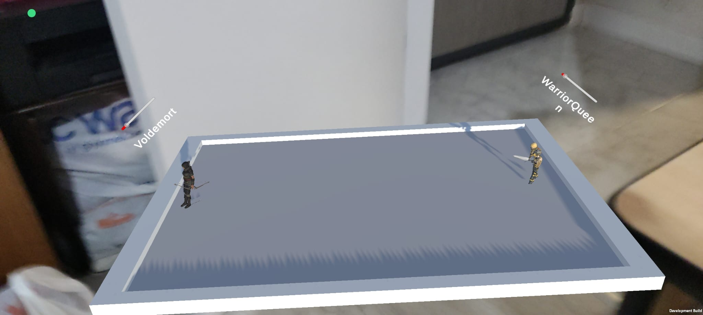

# Arcane Gambit - AR Module
---
## About the Project

This project is an Augmented Reality (AR) module developed within the scope of the CSE 396 course.  
The project aims to deliver a cross-platform AR experience using C#, AR Foundation, and more.

### 🔧 Technologies Used

- **C#** –  Core logic, platform interfaces and integrations
- **AR Foundation** – AR algorithms and components
- **ARCore** - Building for Android 

---

## 📁 Folder Structure

```text
group6-ar-module/
├── src/           # C++ kaynak kodları / C++ source code
├── shaders/       # ShaderLab dosyaları / ShaderLab files
├── unity/         # C# ve Unity entegrasyonu / C# & Unity integration
├── docs/          # Dokümantasyon / Documentation
├── CMakeLists.txt
└── README.md
```

---

### 📷 Demo & Screenshots






---

## License

This project is licensed under the MIT License.
